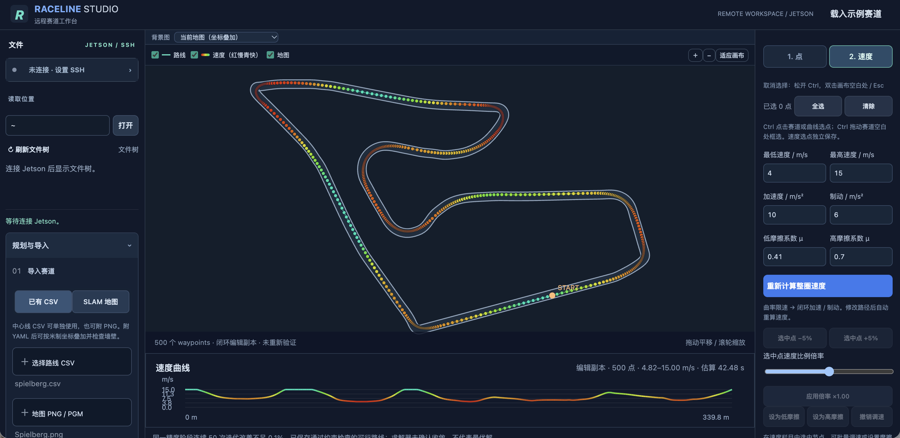

# Raceline Studio

A local web app for planning and editing F1TENTH racelines on macOS. Import a waypoint CSV or a SLAM map, adjust the route and waypoint spacing, set per-point speeds, and export the result. The file browser can read from and save to a Jetson over SSH.



## Features

- Import waypoint CSVs or PNG/PGM maps with YAML metadata.
- Generate a closed route, edit individual or grouped waypoints, and adjust point density around corners.
- View and edit waypoint speeds on the track and in the speed chart.
- Export CSV, images, and reports; browse and save files on a Jetson through SSH.
- Switch the interface between Chinese and English using the button above the right-side editor.

## Run on macOS

Requires Python 3.12 and the dependencies in `requirements.txt`.

```sh
python3 -m venv .venv
.venv/bin/python -m pip install -r requirements.txt
./start.command
```

Open [http://127.0.0.1:8766](http://127.0.0.1:8766). If the virtual environment is already installed, just run `./start.command` or double-click it in Finder.

Jetson file locations can be set in the root-level `remote_paths.json`. It stays on your Mac and is excluded from Git. Generated files are saved under `outputs/`, which is also excluded from Git.

For more detail, see the guides in [`docs/`](docs/).
